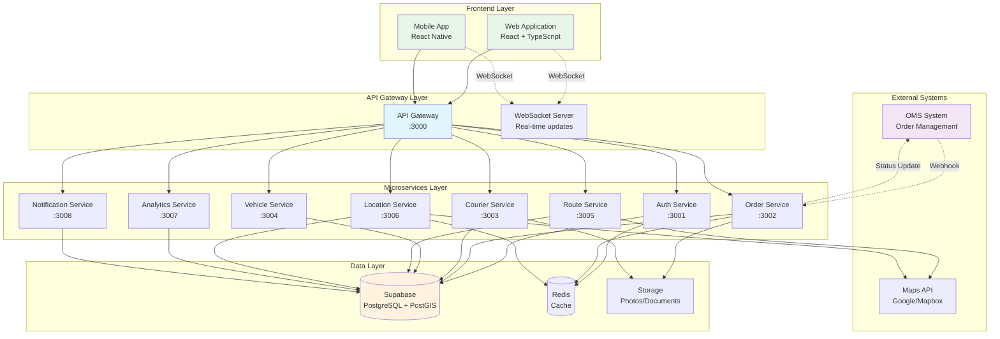
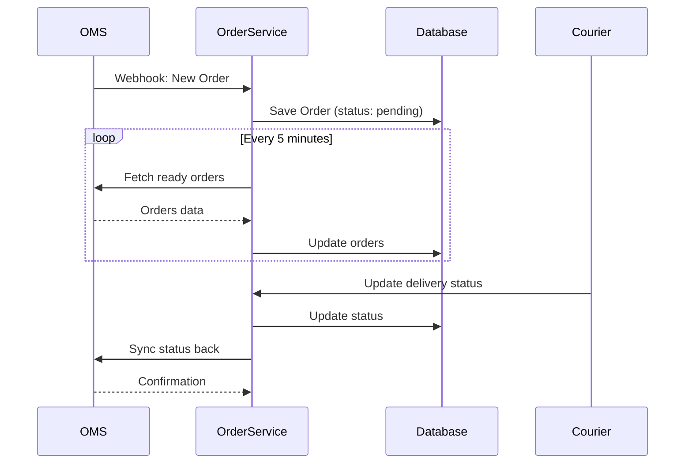

# 📚 TMS (Transport Management System) - Системная документация

## 📋 Оглавление
1. [Обзор системы](#обзор-системы)
2. [Архитектура](#архитектура)
3. [Компоненты системы](#компоненты-системы)
4. [База данных](#база-данных)
5. [Микросервисы](#микросервисы)
6. [API Documentation](#api-documentation)
7. [Интеграции](#интеграции)
8. [Безопасность](#безопасность)
9. [Развертывание](#развертывание)
10. [Мониторинг](#мониторинг)

---

## 🎯 Обзор системы

### Назначение
TMS (Transport Management System) - система управления транспортной логистикой, предназначенная для оптимизации процессов доставки заказов от склада до конечного потребителя.

### Основные функции
- 📦 Интеграция с OMS для получения заказов
- 🚚 Управление парком курьеров и транспорта
- 🗺️ Построение и оптимизация маршрутов доставки
- 📍 Real-time отслеживание курьеров
- 📊 Аналитика и отчетность
- 🔔 Система уведомлений

### Ключевые показатели
- **Курьеров в системе:** 18
- **Типов транспорта:** 5 (bike, scooter, car, van, truck)
- **Складов:** 2
- **Среднее время доставки:** 2-4 часа
- **Поддержка real-time:** WebSocket

---

## 🏗️ Архитектура

### Диаграмма компонентов системы



### Архитектурные принципы

1. **Микросервисная архитектура**
   - Каждый сервис отвечает за свою бизнес-логику
   - Независимое масштабирование
   - Изоляция ошибок

2. **API Gateway Pattern**
   - Единая точка входа
   - Централизованная аутентификация
   - Rate limiting и логирование

3. **Event-Driven Communication**
   - WebSocket для real-time обновлений
   - Webhook интеграция с OMS
   - Pub/Sub для межсервисного взаимодействия

4. **Database per Service**
   - Логическое разделение данных
   - Независимость сервисов
   - Оптимизация запросов

---

## 🔧 Компоненты системы

### Frontend Components

#### Web Application
- **Технологии:** React 18, TypeScript, Redux Toolkit
- **UI Framework:** Material-UI / Ant Design
- **Карты:** Leaflet / Google Maps
- **Real-time:** Socket.io-client

#### Mobile Application (planned)
- **Технологии:** React Native
- **Платформы:** iOS, Android
- **Функции:** GPS tracking, push notifications, offline mode

### Backend Components

#### API Gateway
- **Порт:** 3000
- **Функции:**
  - Proxy routing к микросервисам
  - JWT аутентификация
  - WebSocket server
  - Rate limiting
  - CORS handling
  - Request logging

#### Микросервисы
Детальное описание в разделе [Микросервисы](#микросервисы)

---

## 💾 База данных

### Технологии
- **СУБД:** PostgreSQL 17.4
- **Расширения:** PostGIS 3.3, uuid-ossp, pg_trgm
- **Хостинг:** Supabase
- **Connection Pool:** Transaction Pooler

### Схема данных

#### Основные таблицы

| Таблица | Описание | Записей |
|---------|----------|---------|
| `users` | Пользователи системы (менеджеры) | 1 |
| `couriers` | Курьеры | 18 |
| `vehicles` | Транспортные средства | 3 |
| `stores` | Склады/магазины | 2 |
| `orders` | Заказы на доставку | Dynamic |
| `routes` | Маршруты доставки | Dynamic |
| `route_orders` | Связь заказов с маршрутами | Dynamic |
| `courier_shifts` | Смены курьеров | Dynamic |
| `location_history` | История геолокации | Dynamic |
| `notifications` | Уведомления | Dynamic |

#### Пользовательские типы (ENUM)

```sql
-- Роли пользователей
user_role: 'admin' | 'manager' | 'dispatcher' | 'viewer'

-- Статусы заказов
order_status: 'pending' | 'assigned' | 'picked_up' | 'in_transit' | 
              'delivered' | 'failed' | 'cancelled'

-- Статусы доставки
delivery_status: 'awaiting_pickup' | 'picked_up' | 'in_transit' | 
                 'delivered' | 'failed' | 'returned'

-- Статусы курьеров
courier_status: 'available' | 'busy' | 'offline' | 'on_break'

-- Типы транспорта
vehicle_type: 'bike' | 'scooter' | 'car' | 'van' | 'truck'
```

### Индексы и оптимизация

- **Spatial индексы** для геолокационных запросов (PostGIS)
- **B-tree индексы** для foreign keys и часто используемых полей
- **GIN индексы** для полнотекстового поиска
- **Триггеры** для автоматического обновления `updated_at`

---

## 🚀 Микросервисы

### 1. Auth Service (Port: 3001)

#### Назначение
Управление аутентификацией и авторизацией пользователей

#### Endpoints
```
POST /login              - Вход в систему
POST /register           - Регистрация
POST /refresh            - Обновление токена
POST /logout             - Выход
GET  /me                 - Текущий пользователь
POST /forgot-password    - Восстановление пароля
POST /reset-password     - Сброс пароля
```

#### Технологии
- JWT токены
- Supabase Auth
- bcrypt для хеширования

---

### 2. Order Service (Port: 3002)

#### Назначение
Управление заказами и интеграция с OMS

#### Endpoints
```
GET  /                   - Список заказов
GET  /pending            - Заказы ожидающие назначения
GET  /stats              - Статистика заказов
GET  /:id                - Детали заказа
POST /:id/assign         - Назначить курьера
PUT  /:id/status         - Обновить статус
PUT  /:id/delivery-status - Обновить статус доставки
POST /:id/cancel         - Отменить заказ
POST /batch/assign       - Пакетное назначение
POST /sync               - Синхронизация с OMS

Webhooks:
POST /webhook/oms        - Webhook от OMS
GET  /webhook/oms/health - Health check для OMS
```

#### Интеграция с OMS


---

### 3. Courier Service (Port: 3003)

#### Назначение
Управление курьерами и их сменами

#### Endpoints
```
GET  /                   - Список курьеров
GET  /available          - Доступные курьеры
GET  /:id                - Профиль курьера
PUT  /:id/status         - Обновить статус
GET  /:id/shifts         - Смены курьера
POST /:id/shifts         - Создать смену
PUT  /:id/location       - Обновить местоположение
GET  /:id/stats          - Статистика курьера
GET  /:id/routes         - Маршруты курьера
```

---

### 4. Vehicle Service (Port: 3004)

#### Назначение
Управление транспортными средствами

#### Endpoints
```
GET  /                   - Список ТС
GET  /available          - Доступные ТС
GET  /:id                - Детали ТС
PUT  /:id/status         - Обновить статус
POST /:id/assign         - Назначить курьеру
POST /:id/maintenance    - Отправить на ТО
```

---

### 5. Route Service (Port: 3005)

#### Назначение
Построение и оптимизация маршрутов

#### Endpoints
```
GET  /                   - Список маршрутов
POST /                   - Создать маршрут
GET  /:id                - Детали маршрута
PUT  /:id/optimize       - Оптимизировать маршрут
POST /:id/start          - Начать маршрут
POST /:id/complete       - Завершить маршрут
GET  /:id/navigation     - Навигационные данные
```

#### Алгоритмы оптимизации
- Nearest Neighbor Algorithm
- Genetic Algorithm (planned)
- Time Window Optimization

---

### 6. Location Service (Port: 3006)

#### Назначение
Отслеживание геолокации в реальном времени

#### Endpoints
```
POST /update             - Обновить локацию
GET  /courier/:id        - Локация курьера
GET  /history/:id        - История перемещений
POST /geofence           - Создать геозону
GET  /geofence/check     - Проверить геозону
```

---

### 7. Analytics Service (Port: 3007)

#### Назначение
Сбор метрик и генерация отчетов

#### Endpoints
```
GET  /dashboard          - Метрики дашборда
GET  /reports/delivery   - Отчет по доставкам
GET  /reports/courier    - Отчет по курьерам
GET  /reports/performance - Отчет производительности
GET  /kpi                - KPI метрики
POST /export             - Экспорт отчетов
```

---

### 8. Notification Service (Port: 3008)

#### Назначение
Управление уведомлениями

#### Endpoints
```
POST /send               - Отправить уведомление
GET  /user/:id           - Уведомления пользователя
PUT  /:id/read           - Отметить как прочитанное
POST /broadcast          - Массовая рассылка
```

---

## 🔌 API Documentation

### Аутентификация

Все запросы к защищенным endpoints требуют JWT токен в заголовке:

```http
Authorization: Bearer <token>
```

### Формат ответов

#### Успешный ответ
```json
{
  "data": {},
  "message": "Success",
  "timestamp": "2025-01-19T10:00:00Z"
}
```

#### Ошибка
```json
{
  "error": {
    "code": "ERROR_CODE",
    "message": "Error description",
    "details": {}
  },
  "timestamp": "2025-01-19T10:00:00Z"
}
```

### Rate Limiting

- **Лимит:** 100 запросов за 15 минут
- **Заголовки ответа:**
  - `X-RateLimit-Limit`: Максимум запросов
  - `X-RateLimit-Remaining`: Осталось запросов
  - `X-RateLimit-Reset`: Время сброса

### WebSocket Events

#### Client → Server
```javascript
// Подключение
socket.emit('join', { userId: '...', role: 'manager' })

// Обновление локации
socket.emit('location:update', {
  courierId: '...',
  lat: 55.7558,
  lng: 37.6173,
  speed: 30,
  heading: 45
})

// Обновление статуса заказа
socket.emit('order:statusUpdate', {
  orderId: '...',
  status: 'delivered'
})
```

#### Server → Client
```javascript
// Локация курьера
socket.on('courier:location', (data) => {
  // { courierId, lat, lng, speed, heading }
})

// Обновление заказа
socket.on('order:updated', (data) => {
  // { orderId, status, timestamp }
})

// Уведомления
socket.on('notification', (data) => {
  // { type, title, message, severity }
})
```

---

## 🔗 Интеграции

### OMS (Order Management System)

#### Webhook Endpoints
```
POST /api/orders/webhook/oms
```

#### Webhook Events
- `order.created` - Новый заказ
- `order.updated` - Обновление заказа
- `order.cancelled` - Отмена заказа

#### Signature Verification
```javascript
const signature = crypto
  .createHmac('sha256', WEBHOOK_SECRET)
  .update(payload)
  .digest('hex');
```

### Maps Integration

#### Поддерживаемые провайдеры
- Google Maps API
- Mapbox API
- OpenStreetMap (Nominatim)

#### Функции
- Геокодинг адресов
- Построение маршрутов
- Расчет расстояний и времени
- Матрица расстояний

---

## 🔒 Безопасность

### Аутентификация и авторизация

1. **JWT Tokens**
   - Access Token: 7 дней
   - Refresh Token: 30 дней
   - Secret rotation

2. **Role-Based Access Control (RBAC)**
   - `admin` - полный доступ
   - `manager` - управление операциями
   - `dispatcher` - оперативное управление
   - `viewer` - только просмотр

3. **Row Level Security (RLS)**
   - Включено для всех таблиц Supabase
   - Политики на основе user_id и role

### Защита данных

1. **Шифрование**
   - TLS 1.3 для всех соединений
   - Bcrypt для паролей
   - AES-256 для sensitive data

2. **Валидация**
   - Joi schemas для входных данных
   - SQL injection protection
   - XSS protection (helmet.js)

3. **Rate Limiting**
   - API Gateway level
   - Per-service limits
   - DDoS protection

### Аудит и логирование

1. **Audit Trail**
   - Все изменения логируются
   - User actions tracking
   - API calls logging

2. **Monitoring**
   - Error tracking (Sentry)
   - Performance monitoring
   - Security alerts

---

## 🚢 Развертывание

### Локальная разработка

```bash
# Клонирование репозитория
git clone https://github.com/your-org/tms-backend.git
cd tms-backend

# Установка зависимостей
npm install

# Настройка переменных окружения
cp .env.example .env
# Отредактируйте .env файл

# Запуск всех сервисов
npm run dev

# Или с Docker
docker-compose up -d
```

### Docker Compose Configuration

```yaml
version: '3.8'

services:
  api-gateway:
    build: ./api-gateway
    ports:
      - "3000:3000"
    environment:
      - NODE_ENV=production
    depends_on:
      - auth-service
      - order-service
      
  auth-service:
    build: ./services/auth
    ports:
      - "3001:3001"
    environment:
      - NODE_ENV=production
      
  order-service:
    build: ./services/order
    ports:
      - "3002:3002"
    environment:
      - NODE_ENV=production
      
  # ... остальные сервисы
  
  redis:
    image: redis:alpine
    ports:
      - "6379:6379"
```

### Production Deployment

#### Рекомендуемые платформы

1. **Cloud Providers**
   - AWS ECS/EKS
   - Google Cloud Run
   - Azure Container Instances

2. **PaaS Solutions**
   - Railway
   - Render
   - Fly.io

3. **Kubernetes**
   ```yaml
   apiVersion: apps/v1
   kind: Deployment
   metadata:
     name: tms-api-gateway
   spec:
     replicas: 3
     selector:
       matchLabels:
         app: api-gateway
     template:
       metadata:
         labels:
           app: api-gateway
       spec:
         containers:
         - name: api-gateway
           image: tms/api-gateway:latest
           ports:
           - containerPort: 3000
   ```

### CI/CD Pipeline

```yaml
# .github/workflows/deploy.yml
name: Deploy TMS

on:
  push:
    branches: [main]

jobs:
  test:
    runs-on: ubuntu-latest
    steps:
      - uses: actions/checkout@v2
      - name: Run tests
        run: npm test

  build:
    needs: test
    runs-on: ubuntu-latest
    steps:
      - name: Build Docker images
        run: docker-compose build
      
  deploy:
    needs: build
    runs-on: ubuntu-latest
    steps:
      - name: Deploy to production
        run: |
          # Deploy commands
```

---

## 📊 Мониторинг

### Метрики

#### System Metrics
- CPU Usage
- Memory Usage
- Disk I/O
- Network I/O

#### Application Metrics
- Request Rate
- Response Time
- Error Rate
- Active Users

#### Business Metrics
- Orders per Hour
- Delivery Success Rate
- Average Delivery Time
- Courier Utilization

### Инструменты мониторинга

1. **Logging**
   - Winston для application logs
   - ELK Stack (Elasticsearch, Logstash, Kibana)

2. **Metrics**
   - Prometheus + Grafana
   - Custom dashboards

3. **APM**
   - New Relic
   - DataDog
   - Application Insights

### Alerting

#### Critical Alerts
- Service down
- Database connection lost
- High error rate (>5%)
- Low delivery success rate (<90%)

#### Warning Alerts
- High response time (>1s)
- Memory usage >80%
- Disk space <20%
- Failed OMS sync

---

## 📈 KPI и Метрики успеха

### Операционные KPI

| Метрика | Целевое значение | Текущее |
|---------|------------------|---------|
| Uptime | 99.9% | - |
| Response Time | <200ms | - |
| Delivery Success Rate | >95% | - |
| Average Delivery Time | <3 hours | - |
| Courier Utilization | >70% | - |

### Бизнес KPI

| Метрика | Целевое значение | Текущее |
|---------|------------------|---------|
| Orders per Day | >1000 | - |
| Cost per Delivery | <$5 | - |
| Customer Satisfaction | >4.5/5 | - |
| On-time Delivery | >90% | - |

---

## 🔄 Roadmap

### Q1 2025
- [x] Базовая архитектура микросервисов
- [x] Интеграция с OMS
- [x] База данных и модели
- [ ] Frontend приложение
- [ ] Базовая аналитика

### Q2 2025
- [ ] Мобильное приложение для курьеров
- [ ] Продвинутая оптимизация маршрутов
- [ ] Machine Learning для прогнозирования
- [ ] Интеграция с множественными OMS

### Q3 2025
- [ ] Автоматическое планирование смен
- [ ] Динамическое ценообразование
- [ ] Клиентский трекинг портал
- [ ] Blockchain для proof of delivery

### Q4 2025
- [ ] AI-powered диспетчер
- [ ] Drone delivery integration
- [ ] International expansion support
- [ ] Advanced analytics platform

---

## 👥 Команда и поддержка

### Контакты
- **Email:** support@tms-logistics.ru
- **Documentation:** https://docs.tms-logistics.ru
- **API Status:** https://status.tms-logistics.ru

### Лицензия
Proprietary Software - All Rights Reserved

---

*Последнее обновление: 2025-01-19*
*Версия документации: 1.0.0*